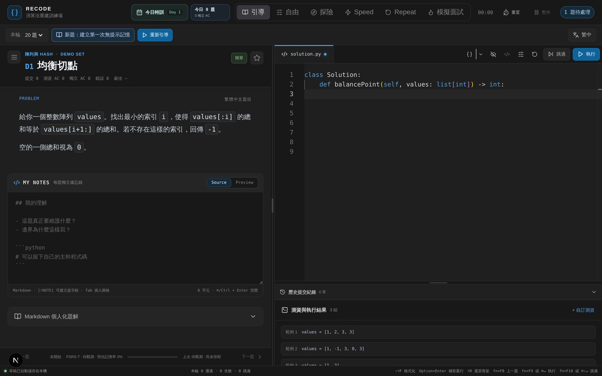

# RECODE

RECODE is a local-first algorithm recall trainer built with Next.js. It combines a bilingual problem workspace, a browser-side Python runner, structured explanations, submission history, and FSRS-based review scheduling.

Problem statements switch between Traditional Chinese and English. It ships a Python
editor, a test-case runner, failure analysis, Speed/Repeat drilling modes, and keeps
progress locally in SQLite. **No problem set is bundled** — one complete worked example
and an authoring skill are included, and the rest are yours to write or import (see `NOTICE.md` for why).

## Screenshot



Above is the bundled example problem `D1 均衡切點` — written for this repository, so it
carries no judge site's text (see `NOTICE.md`). Visible in the shot:

- Top: practice modes — **Guided / Free / Explore / Speed / Repeat / Mock interview** — and the day's training progress
- Left column: the problem, a per-problem Markdown note, and an expandable structured explanation
- Right column: the Monaco editor, submission history and test results. Python runs in the browser through Pyodide; nothing is sent to a server
- Status bar: FSRS-7 scheduling state and this session's pass/fail counts

## Features

- A validated problem format: one complete example ships, and `skills/recode-problem-author` authors the rest
- Problem sets are yours to bring; see `NOTICE.md` for why none is bundled
- Python solutions, deterministic starter skeletons, and browser-run test cases
- Structured Markdown explanations and personal notes
- FSRS-7 spaced repetition, daily training, speed, repeat, and interview modes
- Local-first progress in SQLite; no account is required
- Traditional Chinese and English problem statements

## Bringing your own problems

One complete problem ships in `recode-staging/demo-01/` and
`public/data/problems/demo-01.json` so the format is not hypothetical. It was
written for this repository, so it carries nobody else's text.

```bash
# Author a bundle from a draft, then check it — the validator runs the solution
# against its own fixtures in a sandbox.
python3 skills/recode-problem-author/scripts/derive_problem_fields.py draft.json --output recode-staging/my-problem
python3 skills/recode-problem-author/scripts/validate_bundle.py recode-staging/my-problem --run-tests --project-root .
python3 skills/recode-problem-author/scripts/build_book.py --help
```

`skills/recode-problem-author/SKILL.md` is a Claude Code skill: copy it under
`.claude/skills/` and it will fill the causal chain rather than just the answer.
`references/problem-contract.md` is the authoritative 33-key contract.

## Quick start

Requirements: Node.js 20 or newer, npm, and Python 3.

```bash
npm ci
npm run dev
```

Open <http://127.0.0.1:3000>.

For a production build:

```bash
npm run build
npm start
```

`npm run build:data` is only for maintainers who also have the legacy source workbook modules. A normal clone uses the checked-in generated problem packages and does not regenerate them during build.

## Privacy and network behavior

The server binds to `127.0.0.1` by default. Do not expose it to a LAN or the internet without adding authentication: the state, backup, and restore APIs are intentionally local and currently unauthenticated.

Progress is stored under `.local/`, which is ignored by Git. Monaco and Pyodide are currently loaded from jsDelivr in the browser; the first editor/test run therefore needs network access. Vendoring these assets is on the open-source hardening roadmap.

## Problem authoring Skill

The shareable Codex Skill is in [`skills/recode-problem-author`](skills/recode-problem-author). It creates a staging package containing:

- `problem.json` — canonical site data
- `solution.py` — runnable Python answer
- `explanation.md` — structured human-readable explanation
- `tests.json` — runner cases

The Skill validates schema, deterministic starter/overlay alignment, Python syntax, and cross-file consistency before anything can be imported into `public/data`.

Example prompt:

```text
Use $recode-problem-author to turn this problem statement into a validated RECODE package.
```

## Internationalization

The current language toggle changes problem statements only. The full UI i18n migration is documented in [`docs/i18n.md`](docs/i18n.md); it deliberately separates UI locale, statement locale, stable category IDs, and localized explanations.

## Validation

```bash
npm run typecheck
npm test
```

## Licensing

The application code is released under the MIT License. Problem statements, source-list names, and other third-party material remain the property of their respective owners and are not relicensed by the MIT License. See [`NOTICE.md`](NOTICE.md) before redistributing a dataset.
